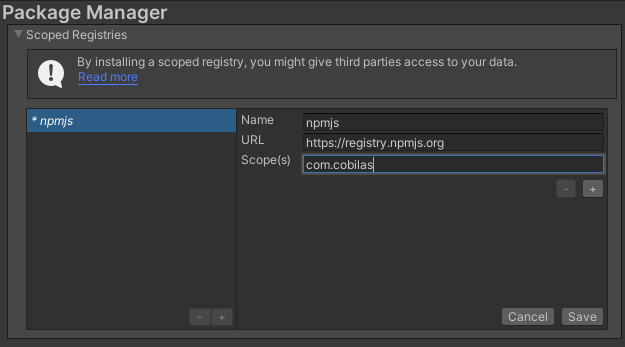

# Unity Editor Terminal
## EN-US
#### ⚠️ Attention
> The development of this package is done during my free time. 
> If you encounter any bugs and go through the ritual of opening an issue, depending on my available free time, I will act as justice, which may be slow but never fails. 
> And if you have feedback, just open an issue as well.
### Installation
 Installation using scoped registries. 
  
 Installation using add package from git url. 
  
### Usage Mode
 The <kbd>Set</kbd> button is used to set the <kbd>WorkingDirectory</kbd> of the command prompt. 
  
 The <kbd>Terminal</kbd> popup defines which command prompt will be used. 
  
 Just use the terminal to enter any command, and it will take care of the rest. 
  

##### [If you'd like to help me](https://www.paypal.com/donate/?business=VN4RAWDSA2PBA&no_recurring=0&currency_code=BRL)
## PT-BR
#### ⚠️ Atenção
> O desenvolvimento deste pacote é feito durante meu tempo liver. 
> Se econtrar algum bug e aquele ritual abrir uma issues, dependendo 
> tempo liver que eu tenha agirei que nem a justiça tarda mas não falha. 
> E se tiver um feedback e só abrir um issues também.
### Instalação
 Instalação usando scoped registries. 
  
 Instalação usando add package from git url. 
  
### Modo de uso
 O botão <kbd>Set</kbd> é usado para definir o <kbd>WorkingDirectory</kbd> do prompt de comando. 
  
 O popup <kbd>Terminal</kbd> define qual prompt de comando vai ser usado. 
  
 Já terminal e só passar algum comando que ele se encarrega do resto. 
  

##### [Caso queira me ajudar](https://www.paypal.com/donate/?business=VN4RAWDSA2PBA&no_recurring=0&currency_code=BRL)